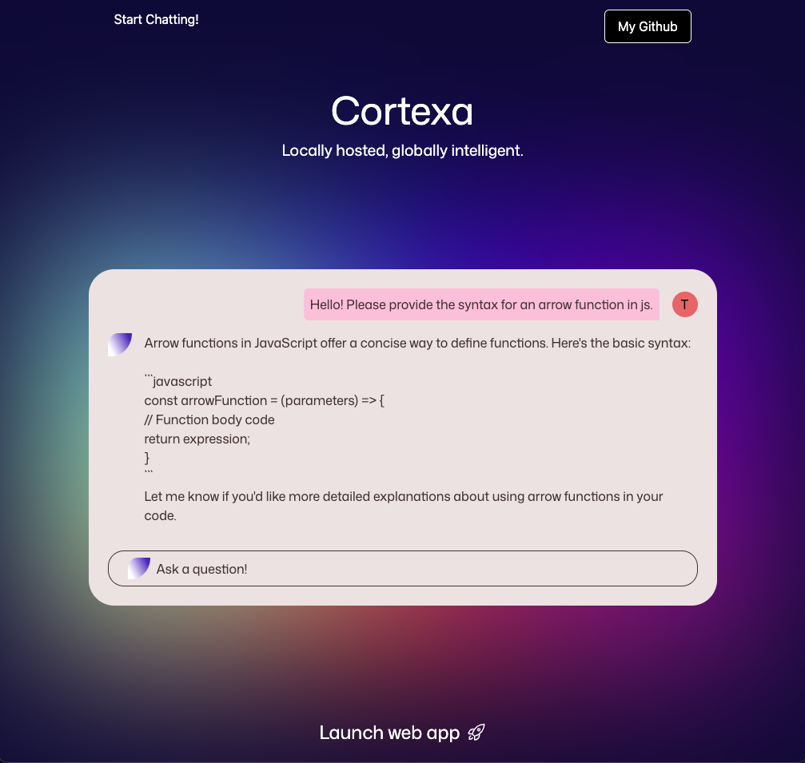
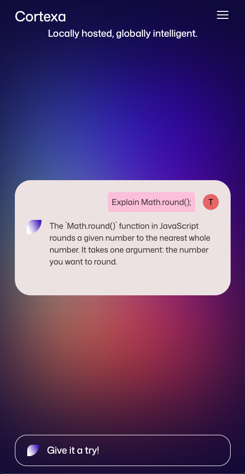

# Cortexa: My Friendly Local AI Chat Assistant

Cortexa is a responsive and intuitive AI chat application designed to demonstrate the capabilities of locally hosted large language models. This project features a clean web interface, built HTML, CSS and JS, backed by a Node.js Express server. The server orchestrates communication with a local Ollama instance running the tinyllama:chat LLM, providing an entirely self-contained AI chat experience.

This project emphasizes local-first AI, allowing users to experience the power of large language models without relying on external cloud services, ensuring privacy and faster response times.

## 🖼️ Screenshots

| Desktop View | Mobile View |
|--------------|-------------|
|  |  | 

## 🚀 Live demo: 
[Try it on GitHub Pages](https://tsohnle95.github.io/self-hosted-chatbot/) 

## ✨ Features
- Locally Hosted AI: Runs entirely on your machine, leveraging Ollama for local LLM inference.
- Ollama Integration: Utilizes the tinyllama:chat model for engaging conversations.
- Responsive Web Interface: A clean and modern UI that adapts seamlessly to desktop and mobile devices.
- Real-time Chat: Enjoy rapid responses from the AI.
- Robust Backend: Built with Node.js and Express for stable performance. 
- Modular Design: Separate frontend and backend for maintainability.

## 🛠️ Tech Stack
  
  Frontend:
  
    - HTML5: Structure and content.
    - CSS3: Styling and responsive design.
    - JavaScript (Vanilla): Interactive chat logic and API communication.
 
  Backend:
  
    - Node.js: JavaScript runtime environment.
    - Express.js: Web application framework for the API.

  AI/LLM
  
      -Ollama: A platform for running large language models locally.
      -tinyllama:chat - The specific language model used for AI responses.

  ## 🛡️ Backend Security 
The backend is built with key security practices to ensure stability and protect the API:

- Strict CORS Policy: The API is configured to only accept requests from a specific, whitelisted frontend origin, preventing unauthorized cross-site access.
- Rate Limiting: Protects against abuse and brute-force attacks by limiting the number of API requests allowed from a single IP address.
- Input Validation: All incoming prompts are validated to ensure they are a non-empty string and do not exceed a maximum length in order to prevent type-related errors and to prevent oversized payloads.

    ## 📄 License

This project is open source and available under the MIT License.

